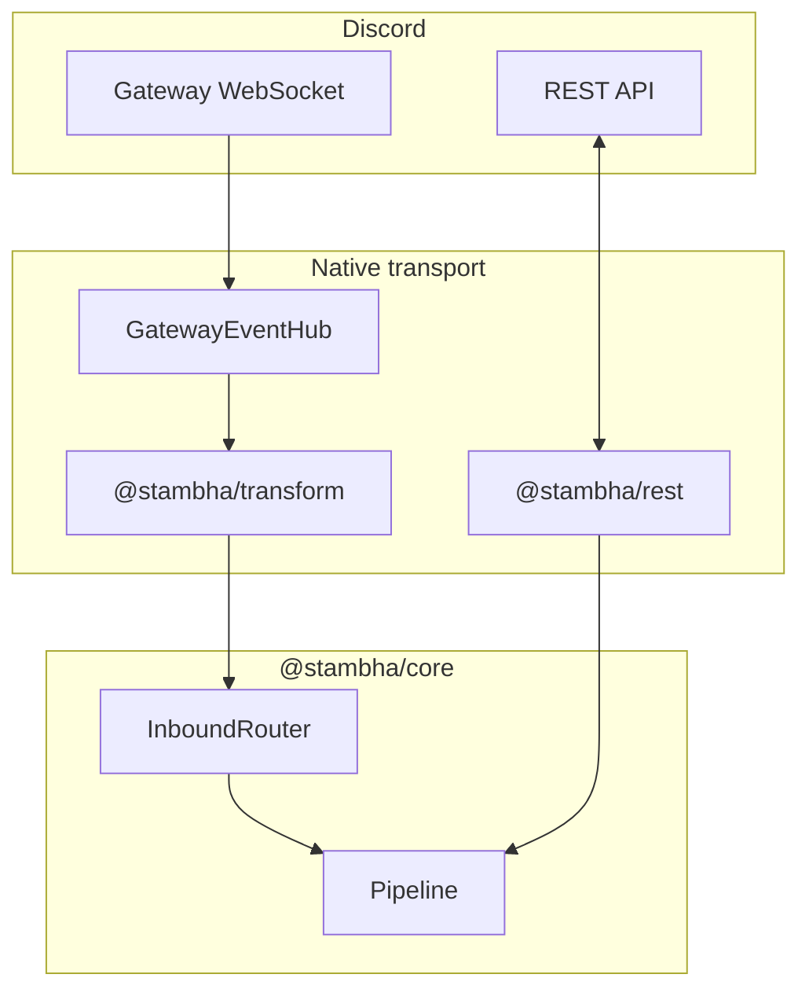

# Stambha

**Native Discord bot framework for Node.js and TypeScript**

[](https://github.com/mivaya/Stambha/blob/main/LICENSE)
[](https://nodejs.org)

Stambha is a **transport-agnostic** bot framework with a first-class **native stack** — your command pipeline, vault, and workers do not depend on discord.js or Discordeno. Folder layout follows [Sapphire](https://sapphirejs.dev/) conventions so teams migrating off Sapphire keep familiar `commands/`, `listeners/`, and `preconditions/` → `gates/` paths.

Connect via `@stambha/rest`, `@stambha/gateway`, and `@stambha/transform`. See [docs/migration/](docs/migration/) and `examples/bot`.

---

## Features

### Command pipeline

Piece-based architecture inspired by Sapphire — commands, hooks, middleware, and post-run epilogues in a predictable pipeline.

- **Commands** — slash, prefix, and context menu in one `Command` class
- **Hooks** — gateway event listeners (`src/listeners/`)
- **Scouts** — passive message watchers (`src/scouts/`)
- **Barriers** — global command blockers (`src/barriers/`)
- **Gates** — per-command checks, Sapphire precondition equivalent (`src/gates/`)
- **Conduits** — middleware before gates (`src/conduits/`)
- **Epilogues** — post-command hooks (`src/epilogues/`)
- **Signals** — buttons, selects, modals via `stambha:` custom ids
- **Chron** — cron scheduled tasks (`src/tasks/`)

Auto-load pieces from disk with `@stambha/loader`.

### Arguments (`@stambha/args`)

Typed prefix lexer and slash option parsing — Sapphire `ArgumentStore` equivalent without coupling to discord.js.

### Gates (`@stambha/gates`)

Built-in preconditions: cooldown, permissions, NSFW, RunIn, guild/DM-only. Attach to commands or register globally.

### Vault (`@stambha/vault`)

Typed guild, user, and member **config** (prefix, flags, modules) — Blueprint + Ledger. Use alongside Prisma/SQL for domain data; Vault is not a full ORM. See [docs/features/vault.md](docs/features/vault.md).

### Sequences

Multi-step flows with `sequence()` and `stambha:seq:` custom ids — wizards and confirmations without manual state machines.

### Native REST (`@stambha/rest`)

Discordeno-inspired centralized REST queue, rate-limit buckets, and split-tier REST worker. No discord.js in the REST process.

### Gateway & sharding (`@stambha/gateway`)

Shard manager, identify/resume payloads, identify budget, resharding policy, gateway↔bot worker bus, and `GatewayEventHub` for native WebSocket workers.

### Tier split

Run gateway, REST, and bot logic in separate processes — see [docs/deployment/tier-split.md](docs/deployment/tier-split.md) and `examples/bot` (`pnpm split:*`).

### Desired properties (`@stambha/transform`)

Slim command contexts and REST payloads — Discordeno-style memory control for large bots.

### Metrics (`@stambha/metrics`)

Prometheus counters and histograms with optional `/metrics` HTTP server.

### Cross-runtime (`@stambha/runtime`)

Shared abstractions for Node.js, Bun, and Deno (env, fs, paths, timers).

---

## How Stambha compares

| | [Sapphire](https://sapphirejs.dev/) | [Discordeno](https://discordeno.deno.dev/) | **Stambha** |
|---|:---:|:---:|:---:|
| Discord coupling | discord.js required | Low-level API | **Native transport** — no library bridge layer |
| Piece / command model | Built-in | Bring your own | **Sapphire-style folders** |
| Preconditions | `@sapphire/*` plugins | DIY | **`@stambha/gates`** |
| Settings | Plugins / manual | DIY | **Vault** (+ your ORM for domain) |
| Gateway + REST split | Manual | Native | **`RestPort` + tier split** |
| Sharding / resharding | Manual | Built-in | **`@stambha/gateway`** |
| Multi-step UI | Plugins | DIY | **Sequences** |
| Observability | Community | DIY | **`@stambha/metrics`** |

---

## Architecture



**Inbound:** your shard worker normalizes gateway payloads → `GatewayEventHub.emit` → `attachStambhaClient` → pipeline.

**Outbound:** commands reply through `RestPort` (in-process `createNativeRestPort` or split-tier `HttpRestPort`).

---

## Installation

```sh
pnpm add @stambha/core @stambha/rest @stambha/gateway @stambha/transform @stambha/loader
```

Optional: `@stambha/vault`, `@stambha/vault-sql`, `@stambha/gates`, `@stambha/args`, `@stambha/metrics`, `@stambha/cache`.

Requires **Node.js 20+**.

---

## Quick start (native stack)

### 1. Command

```ts
// src/commands/General/PingCommand.ts
import { Command, ok, type CommandContext, type Registry } from "@stambha/core";

export class PingCommand extends Command {
  constructor(registry: Registry<Command>) {
    super(registry, {
      name: "ping",
      description: "Replies with Pong!",
      kinds: ["prefix"],
    });
  }

  async execute(ctx: CommandContext) {
    await ctx.reply("Pong!");
    return ok(undefined);
  }
}
```

### 2. Bootstrap

```ts
// src/main.ts
import { createStambhaBot } from "@stambha/core";
import { attachStambhaClient, createGatewayEventHub } from "@stambha/gateway";
import { loadPieces } from "@stambha/loader";
import { createNativeRestPort } from "@stambha/rest";

const token = process.env.DISCORD_TOKEN!;
const client = createStambhaBot({
  prefix: "!",
  restPort: createNativeRestPort(token),
});

await loadPieces(client);

const hub = createGatewayEventHub();
attachStambhaClient(hub, client);
client.setBridge(hub);

hub.markReady({ user: { id: "YOUR_BOT_USER_ID" } });
await client.start();

// Your WebSocket shard worker feeds events, e.g.:
// hub.emit("messageCreate", { id, content, channelId, guildId, author: { id, bot: false } });
```

### 3. Tier split (production)

```bash
cd examples/bot
pnpm rest    # REST worker
pnpm bot     # bot worker
pnpm gateway # gateway relay (native hub)
```

---

## Project layout (Sapphire-aligned)

```text
src/
  commands/       # slash, prefix, context menu
  listeners/      # Hook pieces (Sapphire listeners)
  gates/          # Gate pieces (Sapphire preconditions)
  scouts/         # passive watchers
  barriers/       # global blockers
  epilogues/      # post-command hooks
  conduits/       # middleware
  signals/        # buttons, modals, selects
  tasks/          # Chron cron jobs
  schemas/        # Vault blueprints
  main.ts
```

Full mapping: [docs/guide/project-structure.md](docs/guide/project-structure.md).

---

## Packages

Published under the [**@stambha** npm org](https://www.npmjs.com/org/stambha). Each package has its own README with install steps and examples.

| Package | Description |
|---------|-------------|
| [`@stambha/core`](packages/core) | Client, pipeline, registries, sequences, chron |
| [`@stambha/rest`](packages/rest) | **Native REST** client + worker |
| [`@stambha/gateway`](packages/gateway) | **Native gateway** hub, sharding, worker bus |
| [`@stambha/transform`](packages/transform) | Payload normalization + REST contexts |
| [`@stambha/transport`](packages/transport) | API constants, session, rate-limit routes |
| [`@stambha/loader`](packages/loader) | Auto-load Sapphire-style folders |
| [`@stambha/gates`](packages/gates) | Built-in gates (Sapphire preconditions) |
| [`@stambha/args`](packages/args) | Argument parsing |
| [`@stambha/plugins`](packages/plugins) | Plugin lifecycle and DI container |
| [`@stambha/vault`](packages/vault) | Settings persistence |
| [`@stambha/vault-sql`](packages/vault-sql) | SQLite and PostgreSQL vault drivers |
| [`@stambha/metrics`](packages/metrics) | Prometheus metrics |
| [`@stambha/cache`](packages/cache) | Pluggable cache |
| [`@stambha/runtime`](packages/runtime) | Node / Bun / Deno helpers |

---

## Examples

| Example | Stack |
|---------|--------|
| [`examples/bot`](examples/bot) | Full Sapphire-style layout — commands, gates, vault, signals, … |
| [`examples/minimal`](examples/minimal) | MockBridge + unit-style invoke |

See [`examples/README.md`](examples/README.md) for run instructions.

---

## Documentation

**Community site:** run `pnpm docs:dev` and open the VitePress preview, or read markdown under [`docs/`](docs/).

Deploy to GitHub Pages: see [Hosting the docs](docs/guide/hosting-the-docs.md).

| Section | Topic |
|---------|-------|
| [Getting started](docs/guide/getting-started.md) | Install and first bot |
| [Features](docs/features/gates.md) | Gates, vault, sequences, … |
| [Deployment](docs/deployment/overview.md) | Tier split, gateway, metrics |
| [Migration](docs/migration/) | From Sapphire or Discordeno |

Contributor planning docs: [`docs/internal/`](docs/internal/).

---

## Development

```bash
git clone git@github.com:mivaya/Stambha.git
cd Stambha
pnpm install
pnpm build
pnpm test
```

Branch naming: `feature/{short-description}`.

Org security & GitHub setup: [`.github/ORG_SECURITY.md`](.github/ORG_SECURITY.md).

---

## Status

**v0.2.1** — Package READMEs and dual ESM/CJS builds for CommonJS bot migrations. See [CHANGELOG.md](CHANGELOG.md). API may still evolve before `1.0.0`.
