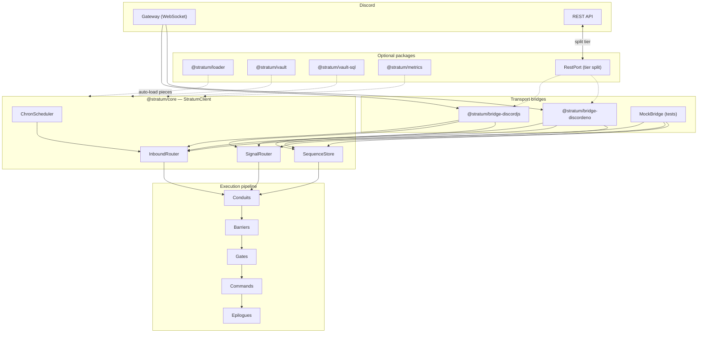

# Stratum

**A transport-agnostic Discord bot framework for Node.js and TypeScript**

[](https://github.com/Interittus13/Stratum/blob/main/LICENSE)
[](https://nodejs.org)

Stratum separates **bot logic** from **Discord transport**. Write commands, hooks, gates, and vault schemas once; run them through **discord.js**, **Discordeno**, or a mock bridge for tests. Folder layout matches [Sapphire](https://sapphirejs.dev/) and [Klasa](https://github.com/dirigeants/klasa) so existing bots migrate without renaming everything.

---

## Why Stratum?

Most Discord frameworks pick one library and bake it in. Sapphire and Klasa are excellent on **discord.js**, but your command pipeline, settings layer, and deployment topology are tied to that stack. Discordeno gives you performance and sharding primitives, but you still build structure yourself.

Stratum sits in the middle:

- **Core first** — routing, pipeline, registries, sequences, and scheduled tasks live in `@stratum/core`, independent of any Discord library.
- **Bridges second** — thin adapters translate gateway events and REST calls into Stratum contexts. Swap or add transports without rewriting business logic.
- **Production shapes built in** — tier-split gateway/REST workers, schema-driven **Vault** persistence, **Chron** cron tasks, and Prometheus **metrics** are first-class, not bolt-on plugins.
- **No CLI required** — bootstrap programmatically; your repo layout stays yours.

If you want Sapphire’s piece model and Klasa’s monitors/inhibitors, but need Discordeno, split processes, or testable core logic, Stratum is aimed at you.

---

## How is this different?

| | [Sapphire](https://sapphirejs.dev/) | [Klasa](https://github.com/dirigeants/klasa) | [Discordeno](https://discordeno.deno.dev/) | **Stratum** |
|---|:---:|:---:|:---:|:---:|
| Primary transport | discord.js | discord.js | Low-level bot API | **Pluggable bridges** |
| Command / listener model | Built-in stores | Built-in stores | Bring your own | **Same folder names** as Sapphire/Klasa |
| Multi-step UI flows | Plugins / manual | Manual | Manual | **Sequences** (`stratum:seq:…`) |
| Guild / user settings | Plugins | Providers | DIY | **Vault** (Blueprint + Ledger) |
| Gateway + REST split | Manual | Manual | Supported natively | **`RestPort` + tier split** |
| Observability | Community plugins | Community plugins | DIY | **`@stratum/metrics`** |
| Entry point | CLI + client subclass | CLI + client subclass | `createBot()` | **`createStratumBot()`** |

Stratum is **not** a replacement for discord.js or Discordeno — it orchestrates them. You still install the transport you prefer; Stratum wires events into a shared pipeline.

---

## Architecture



**Inbound flow:** a bridge receives a Discord event → routers build a typed context → **Conduits** (middleware) → **Barriers** (global blockers) → **Gates** (per-command checks) → **Command** → **Epilogues** (post-run hooks).

**Tier split:** a gateway worker handles events only; outbound REST goes through `HttpRestPort` to a dedicated REST worker (`POST /v1/rest`). See [docs/TIER_SPLIT.md](docs/TIER_SPLIT.md).

---

## Features

- Written in TypeScript with strict, transport-agnostic types
- **Commands**, **Hooks**, **Scouts**, **Barriers**, **Gates**, **Epilogues**, **Conduits**, **Signals**, **Chron**
- Auto-loader for Sapphire/Klasa-style folders (`@stratum/loader`)
- **Sequences** for guided multi-step interactions
- **Vault** — schema-first guild/user persistence with SQLite and PostgreSQL drivers
- **Metrics** — Prometheus counters and histograms with optional `/metrics` server
- **discord.js** and **Discordeno** bridges; mock bridge for unit tests
- Programmatic bootstrap — no framework CLI

---

## Installation

Stratum is a monorepo. Published packages are scoped under `@stratum/*`. Install the core plus the bridge you use:

**discord.js**

```sh
pnpm add @stratum/core @stratum/bridge-discordjs @stratum/loader discord.js
```

**Discordeno**

```sh
pnpm add @stratum/core @stratum/bridge-discordeno @stratum/loader @discordeno/bot
```

Optional: `@stratum/vault`, `@stratum/vault-sql`, `@stratum/metrics`.

Requires **Node.js 20+** (22.5+ for `@stratum/vault-sql` SQLite).

---

## Quick start

### 1. Create a command

```ts
// src/commands/General/PingCommand.ts
import { Command, ok, type CommandContext, type Registry } from "@stratum/core";

export class PingCommand extends Command {
  constructor(registry: Registry<Command>) {
    super(registry, {
      name: "ping",
      description: "Replies with Pong!",
      kinds: ["slash", "prefix"],
    });
  }

  async execute(ctx: CommandContext) {
    await ctx.reply("Pong!");
    return ok(undefined);
  }
}
```

### 2. Create a listener (Hook)

```ts
// src/listeners/ReadyListener.ts
import { Hook, type Registry } from "@stratum/core";

export class ReadyListener extends Hook {
  constructor(registry: Registry<Hook>) {
    super(registry, { name: "ready", event: "ready", once: true });
  }

  handle(): void {
    console.log("Bot is ready.");
  }
}
```

### 3. Bootstrap the bot

```ts
// src/main.ts
import { createStratumBot } from "@stratum/core";
import { createDiscordJsBridge } from "@stratum/bridge-discordjs";
import { loadPieces } from "@stratum/loader";
import { GatewayIntentBits } from "discord.js";

const token = process.env.DISCORD_TOKEN!;
const client = createStratumBot({ prefix: "!" });

await loadPieces(client, { context: { client } });

const bridge = createDiscordJsBridge(
  {
    token,
    intents: [
      GatewayIntentBits.Guilds,
      GatewayIntentBits.GuildMessages,
      GatewayIntentBits.MessageContent,
    ],
  },
  client,
);

client.setBridge(bridge);

client.on("ready", () => {
  console.log(`Online as ${client.botUserId}`);
});

await client.start();
```

Deploy slash commands with `@stratum/bridge-discordjs` (`deploySlashCommands`) — see [examples/discord-bot](examples/discord-bot).

### Minimal test (no Discord)

```ts
import { createStratumBot, MockBridge, type CommandContext } from "@stratum/core";
import { PingCommand } from "./commands/General/PingCommand.js";

const client = createStratumBot({ bridge: new MockBridge(), prefix: "!" });
client.register(new PingCommand(client.registries.commands));
await client.start();

await client.invoke("ping", {
  kind: "slash",
  commandName: "ping",
  userId: "u1",
  guildId: "g1",
  channelId: "c1",
  raw: {},
  reply: async (text) => console.log(text),
  replyEphemeral: async (text) => console.log(text),
});

await client.stop();
```

See [examples/minimal](examples/minimal) for a runnable version.

---

## Project layout

Stratum uses the same folders as Sapphire and Klasa:

```text
src/
  commands/       # slash, prefix, context menu
  listeners/      # gateway events (Sapphire listeners / Klasa events)
  scouts/         # passive message watchers (Klasa monitors)
  barriers/       # global command blockers (Klasa inhibitors)
  gates/          # per-command checks (Sapphire preconditions)
  epilogues/      # post-command hooks (Klasa finalizers)
  conduits/       # middleware before barriers/gates
  signals/        # buttons, selects, modals
  tasks/          # scheduled Chron jobs
  schemas/        # Vault blueprints
  main.ts
```

| Folder | Sapphire | Klasa | Stratum class |
|--------|----------|-------|---------------|
| `commands/` | commands | commands | `Command` |
| `listeners/` | listeners | events | `Hook` |
| `scouts/` | — | monitors | `Scout` |
| `barriers/` | — | inhibitors | `Barrier` |
| `gates/` | preconditions | — | `Gate` |
| `epilogues/` | — | finalizers | `Epilogue` |
| `tasks/` | — | tasks | `Chron` |

Full guide: [docs/PROJECT_STRUCTURE.md](docs/PROJECT_STRUCTURE.md).

---

## Packages

| Package | Description |
|---------|-------------|
| [`@stratum/core`](packages/core) | Client, registries, pipeline, signals, sequences, chron |
| [`@stratum/bridge-discordjs`](packages/bridge-discordjs) | discord.js bridge + slash deploy |
| [`@stratum/bridge-discordeno`](packages/bridge-discordeno) | Discordeno v21 bridge |
| [`@stratum/loader`](packages/loader) | Auto-load pieces from `src/commands/`, etc. |
| [`@stratum/vault`](packages/vault) | Ledger / Blueprint / Record persistence |
| [`@stratum/vault-sql`](packages/vault-sql) | SQLite + PostgreSQL drivers |
| [`@stratum/metrics`](packages/metrics) | Prometheus metrics + `/metrics` HTTP server |

---

## Examples

| Example | Description |
|---------|-------------|
| [`examples/minimal`](examples/minimal) | Mock bridge + manual command registration |
| [`examples/discord-bot`](examples/discord-bot) | Full bot: loader, SQLite vault, signals, metrics |
| [`examples/discordeno-bot`](examples/discordeno-bot) | Discordeno transport + loader |
| [`examples/tier-split`](examples/tier-split) | Split gateway + REST worker processes |

```bash
cd examples/discord-bot
cp .env.example .env   # set DISCORD_TOKEN
pnpm install
pnpm start
```

---

## Documentation

| Guide | Topic |
|-------|-------|
| [docs/PROJECT_STRUCTURE.md](docs/PROJECT_STRUCTURE.md) | Folders and piece naming |
| [docs/VAULT.md](docs/VAULT.md) | Guild settings with Blueprints |
| [docs/SEQUENCES.md](docs/SEQUENCES.md) | Multi-step UI flows |
| [docs/CHRON.md](docs/CHRON.md) | Scheduled tasks |
| [docs/TIER_SPLIT.md](docs/TIER_SPLIT.md) | Gateway / REST workers |
| [docs/BRIDGE_DISCORDENO.md](docs/BRIDGE_DISCORDENO.md) | Discordeno bridge |
| [docs/METRICS.md](docs/METRICS.md) | Prometheus observability |
| [docs/PHASES.md](docs/PHASES.md) | Roadmap and phase history |

---

## Development

```bash
git clone git@github.com:Interittus13/Stratum.git
cd Stratum
pnpm install
pnpm build
pnpm test
```

Branch naming: `feature/{short-description}` (e.g. `feature/sequences`).

Report issues on [GitHub Issues](https://github.com/Interittus13/Stratum/issues).

---

## Status

Early development (`0.0.1`). Core pipeline, both bridges, loader, vault, sequences, chron, tier split, and metrics are implemented. API may change before `1.0.0`.
