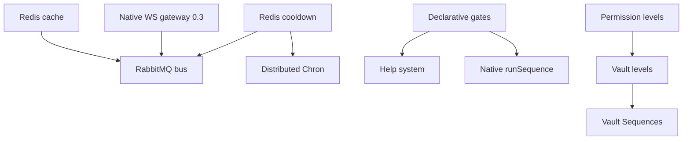

# Future release plan (post-1.0 / v2)

Target: **major release** after `1.0.0` stabilizes the native stack (`@stambha/rest`, `@stambha/gateway`, `@stambha/transform`, `@stambha/core`).

This document turns product ideas into **phased, shippable work**. Branch rule unchanged: `feature/{short-name}`.

---

## Goals

1. **Scale like Discordeno** — shared state and messaging across gateway / REST / bot workers.
2. **DX like Sapphire** — declare command behavior in options; gates wire automatically.
3. **Governance** — numeric permission levels with guild overrides.
4. **Stambha-only** — capabilities no other framework combines in one native stack.

---

## Pillar A — Distributed infrastructure

Today: in-memory cache (`@stambha/cache`), in-memory cooldown store, HTTP worker bus, no bundled metrics backend.

| Component | Purpose | Package (proposed) | Notes |
|-----------|---------|-------------------|--------|
| **Redis cache** | Guild/user/session cache across workers | `@stambha/cache-redis` | Implements existing `Cache` interface |
| **Redis cooldown store** | Shared rate limits in split tier | `@stambha/gates` + redis driver | Plugs into `CooldownStore` (already abstracted) |
| **Redis Vault driver** | Optional shared settings (or cache layer) | `@stambha/vault-redis` | Debounced writes; SQLite/Postgres remain |
| **Message bus (RabbitMQ)** | Gateway → bot events at scale; fan-out | `@stambha/bus` | Interface: `WorkerBus` + `RabbitWorkerBus` |
| **InfluxDB telemetry** | Gateway identify rate, REST 429s, command latency | `@stambha/metrics-influx` | Optional sink beside Prometheus |
| **Native WebSocket gateway** | Stop requiring custom `hub.emit` wiring | `@stambha/gateway` (extend) | Shard connect, resume, identify budget integration — **0.3.0** ([release-plan](./release-plan.md) N1 / ADR 005) |

### Suggested phases

| Phase | Branch | Deliverable |
|-------|--------|-------------|
| A1 | `feature/cache-redis` | `createRedisCache()` + docs |
| A2 | `feature/cooldown-redis` | `RedisCooldownStore` for split tier |
| A3 | `feature/bus-rabbitmq` | `RabbitWorkerBus` + tier-split example |
| A4 | `feature/metrics-influx` | Influx line protocol adapter |
| ~~A5~~ | `feature/gateway-ws` | **Moved to 0.3.0** — bundled shard client → `GatewayEventHub` |

**Design rule:** every backend implements a **core interface** (like `Cache`, `CooldownStore`, `WorkerBus`) so monolith/single-node still works with memory defaults.

---

## Pillar B — Sapphire-style command options

Reference: [Sapphire Command Options](https://sapphirejs.dev/docs/Guide/commands/command-options).

Today Stambha supports the **behavior** via manual gates, but not **declarative options** on `Command`.

### Gap matrix

| Sapphire option | Stambha today | v2 target |
|-----------------|---------------|-----------|
| `cooldownDelay` / `cooldownLimit` / `cooldownScope` | Manual `cooldownGate()` | Auto-gate from `CommandOptions` |
| `cooldownFilteredUsers` | Gate option | Same |
| `requiredUserPermissions` / `requiredClientPermissions` | Manual permission gates | Auto-gate from options |
| `nsfw` | Manual `nsfwGate()` | `nsfw: true` on command |
| `runIn` | Manual `runInGate()` | `runIn: RunIn[]` on command |
| `preconditions` | `gates: [...]` array | Alias + name registry resolution |
| `description` | **Done** | — |
| `detailedDescription` | Missing | Help system + typed object |
| `fullCategory` | `category` / `subCategory` | `fullCategory: string[]` from loader path |
| `aliases` | **Done** | + `generateDashLessAliases` / `generateUnderscoreLessAliases` |
| Prefix `flags` / `options` / `quotes` / `separators` | Partial (`@stambha/args` lexer) | Command-level prefix strategy |
| `typing` | Missing | Optional typing indicator via REST |
| `dmPermission` / slash permissions | **Done** (slash deploy) | — |

### Implementation sketch

```ts
// packages/core — extended CommandOptions
interface CommandOptions {
  cooldown?: { limit: number; delay: number; scope?: CooldownScope; filteredUsers?: string[] };
  requiredUserPermissions?: PermissionFlag;
  requiredClientPermissions?: PermissionFlag;
  nsfw?: boolean;
  runIn?: RunInOption[];
  detailedDescription?: DetailedDescription; // module-augmentable
  flags?: string[] | boolean;
  options?: string[] | boolean;
  // ...
}
```

**Phase B1** (`feature/declarative-gates`): `resolveCommandGates(command)` in `@stambha/gates` — merges declarative options + explicit `gates[]` before pipeline run.

**Phase B2** (`feature/prefix-flags`): Extend `@stambha/args` for Sapphire-style `--key=value` flags on prefix commands.

**Phase B3** (`feature/help-system`): `@stambha/help` or core help registry using `detailedDescription`, categories, permission level hints.

---

## Pillar C — Permission levels

Numeric **permission levels** (Everyone → Moderator → Administrator → Owner) gate commands by role and config. Stambha implements this **without** coupling to discord.js.

### Proposed API

```ts
// @stambha/levels (new package)
interface PermissionLevelRegistry {
  register(level: number, name: string, check: (ctx: CommandContext) => boolean | Promise<boolean>): void;
}

// CommandOptions
permissionLevel?: number; // minimum level required

// Default ladder (configurable)
// 0 Everyone, 1 Moderator (ManageMessages), 2 Admin (Administrator), 10 Bot Owner (env)
```

### Vault integration (Stambha-only twist)

Store **per-guild level overrides** in Vault:

```ts
// schemas/ModerationBlueprint.ts
memberLevels: field.record(field.number()) // userId → level
```

A user's effective level = `max(discordDerivedLevel, vaultOverride)`.

**Phases:**

| Phase | Branch | Deliverable |
|-------|--------|-------------|
| C1 | `feature/permission-levels` | `@stambha/levels` + `permissionLevelGate` |
| C2 | `feature/levels-vault` | Guild member level ledger + admin commands |

---

## Pillar E — Dashboard HTTP API (`@stambha/dashboard`)

**Repo:** Ships from the **official plugins monorepo** ([ADR 003](./adr/003-plugins-monorepo.md)) — not the core Stambha repo. Do **not** use Sapphire-style names like `@stambha/plugin-api`.

**Today:** No equivalent to [Sapphire Plugin API](https://sapphirejs.dev/docs/Guide/plugins/API/getting-started). Stambha has **operator** HTTP servers only:

| Server | Purpose | Not for dashboards |
|--------|---------|-------------------|
| `createNativeRestWorker` | Discord REST proxy | Internal worker protocol |
| `createWorkerServer` | Gateway ↔ bot bus | Internal worker protocol |
| `createReshardServer` | Reshard operator API | Ops only |
| `createMetricsServer` | Prometheus scrape | Metrics only |

`@stambha/plugins` provides **lifecycle hooks + DI** (`preStart`, `postLoad`, `StambhaContainer`) — not route registration or OAuth.

**Vault** covers **settings + bot-shaped data** (guild/user/member config, flags, level overrides) — not heavy domain ORM tables. See [ADR 004](./adr/004-vault-scope-orm-coexistence.md). Vault does not replace **HTTP exposure** for a web dashboard.

### Target (dashboard backend, Stambha naming)

New package: **`@stambha/dashboard`** — optional extension in **`stambhadev/plugins`**, not in core.

| Feature | Sapphire `@sapphire/plugin-api` (reference only) | `@stambha/dashboard` |
|---------|---------------------|----------------|
| HTTP server on bot process | Yes | Yes — `listenOptions.port` |
| Route registration | File-based / decorators | `defineRoute` or `routes/` folder + loader |
| Discord OAuth2 login | Built-in | OAuth2 for dashboard admins |
| Auth cookie / session | Yes | Yes — HTTP-only cookie |
| CORS `origin` | Yes | Yes |
| Rate limits on routes | Yes | Reuse `@stambha/gates` / cooldown patterns |
| Read/write bot config | Custom | **First-class Vault routes** — typed blueprints |
| Tier split | Single process | API on **bot worker**; Vault driver shared (Redis/SQL) |

### Example API (sketch)

```ts
import { createDashboardPlugin } from "@stambha/dashboard";

export default createDashboardPlugin({
  listen: { port: 4000 },
  origin: "https://dashboard.example.com",
  auth: {
    clientId: process.env.CLIENT_ID!,
    clientSecret: process.env.CLIENT_SECRET!,
    redirect: "https://dashboard.example.com/callback",
    scopes: ["identify"],
  },
  routes: (app, ctx) => {
    app.get("/guilds/:id/settings", async (req) => {
      const record = ctx.vault.ledger("guild").acquire(req.params.id);
      await record.sync();
      return record.toJSON();
    });
  },
});
```

Attach via existing `attachPlugins(client, { plugins: [apiPlugin] })`.

### Phases

| Phase | Branch (plugins repo) | Deliverable |
|-------|----------------------|-------------|
| E1 | `feature/dashboard-core` | Router interface, `createDashboardServer`, health route |
| E2 | `feature/dashboard-oauth` | Discord OAuth2 + session middleware |
| E3 | `feature/dashboard-vault` | CRUD routes for Vault ledgers (dashboard backend) |
| E4 | `feature/dashboard-split` | API sidecar or bot-worker mount for tier split |

**Dependency:** Vault (done) + permission levels (Pillar C) for locking admin routes.

**Non-goal:** Bundling a frontend — API only; dashboard is user's Next.js/React app.

---

## Pillar D — Stambha-only (neither Sapphire, discord.js, nor Discordeno)

These are the **reason to pick Stambha** after parity work is done.

| Feature | Why unique | Package |
|---------|------------|---------|
| **Vault HTTP API** | Dashboard reads/writes Vault via `@stambha/dashboard` — typed, not ad-hoc JSON | `@stambha/dashboard` + `@stambha/vault` |
| **Vault + Sequences** | Setup wizards persist answers to schema | `@stambha/core` sequences + vault ctx |
| **Declarative gates + split tier** | Sapphire DX with Discordeno topology | core + gates + redis cooldown |
| **Desired properties + permission levels** | Trim payloads *and* keep enough meta for levels/gates | `@stambha/transform` |
| **Outcome pipeline everywhere** | Typed `ok`/`err` — not exceptions in commands | `@stambha/core` (done — extend to bus handlers) |
| **Reshard-aware command routing** | Pause/drain commands during resharding | `@stambha/gateway` + `Barrier` |
| **Distributed Chron** | One cron tick cluster-wide (Redis lock) | `@stambha/core` chron + redis |
| **Native deploy + diff** | `deployCommands` without any library bridge | `@stambha/rest` (done — extend guild sync) |
| **Transport-agnostic Sequences** | `runSequence` over REST interactions (not bridge-tied) | `@stambha/core` + `@stambha/rest` |
| **Observability bundle** | Prometheus + Influx + structured command audit epilogues | `@stambha/metrics` family |
| **Cross-runtime pieces** | Same bot folder on Node/Bun; workers on Node | `@stambha/runtime` (done — document limits) |

### Highest-impact originals to prioritize

1. **`runSequence` native** — finish Sequences (biggest Sapphire parity gap after declarative options).
2. **Distributed cooldown + Chron** — required for honest multi-worker production.
3. **Vault-driven guild config** — prefixes, feature flags, level overrides in one system (alongside Prisma for domain data).
4. **Reshard barrier** — operational safety large bots feel immediately.

---

## Suggested release sequencing

```text
0.3.0  — Bundled native WS gateway (ex-A5), native migration examples
       │
1.0.0  — Native stack stable API, docs, examples/bot, known gaps documented
       │
1.x    — Bugfixes, redis cache, declarative gates (B1), permission levels (C1)
       │
2.0.0  — Breaking only if needed: CommandOptions expansion, bus abstraction,
         native runSequence, distributed chron/cooldown
```

### Dependency graph



---

## Explicit non-goals (v2)

- Re-introducing `@stambha/bridge-*` packages
- 1:1 Sapphire plugin compatibility layer or `@stambha/plugin-*` package names
- Bundling official extensions inside the core monorepo (use **`stambhadev/plugins`** instead)
- 1:1 Discordeno API surface inside core
- Requiring Redis/RabbitMQ/Influx for single-process bots (always optional drivers)
- Class-only **or** function-only pieces — both stay supported
- **Vault as a full ORM** — economy, quest graphs, analytics, and large mod-log stores stay in Prisma/SQL ([ADR 004](./adr/004-vault-scope-orm-coexistence.md))

---

## Open questions (decide before implementation)

1. **Package naming:** `@stambha/bus-rabbit` vs optional deps in `@stambha/gateway`?
2. **Permission levels default ladder:** Fixed numeric ladder vs Discord permission-bit derived only?
3. **Influx vs Prometheus:** Dual export forever, or Influx only for gateway ops?
4. **2.0 breaking changes:** Auto-gates from options — merge order with manual `gates[]`?
5. **Bundled gateway:** In `@stambha/gateway` or separate `@stambha/gateway-ws`?
6. **Plugins org/repo name:** `stambhadev/plugins` vs another GitHub org — decide before first publish.

---

## Official extensions monorepo (plugins repo)

Separate Git repo [**Mivaya/Stambha-plugins**](https://github.com/Mivaya/Stambha-plugins) ([ADR 003](./adr/003-plugins-monorepo.md)), same role as [sapphiredev/plugins](https://github.com/sapphiredev/plugins).

| Package | Purpose |
|---------|---------|
| `@stambha/dashboard` | HTTP + OAuth2 + Vault routes for web dashboards (Pillar E) |
| `@stambha/i18n` | Locale files, command/help translation |
| `@stambha/cron` | Distributed scheduled tasks (pairs with Redis lock in core) |
| `@stambha/dev-reload` | Dev-only piece hot reload |
| `@stambha/editable-commands` | Owner-editable command text (if pursued) |

**Core repo keeps:** `@stambha/plugins` (host only). **Install:** `pnpm add @stambha/dashboard` from npm; register with `attachPlugins()` like any bot-local plugin.

---

## Related

- [roadmap.md](./roadmap.md) — feature matrix (phases 1–21)
- [release-plan.md](./release-plan.md) — 0.2.2 / 0.3.0 migration fixes (does not duplicate this doc)
- [migration-shims.md](./migration-shims.md) — app-layer patterns validated by production Sapphire migrations
- [adr/003-plugins-monorepo.md](./adr/003-plugins-monorepo.md) — repo split + naming
- [adr/004-vault-scope-orm-coexistence.md](./adr/004-vault-scope-orm-coexistence.md) — Vault Path B scope
- [phases.md](./phases.md) — completed work
- [adr/002-bridge-deprecation.md](./adr/002-bridge-deprecation.md) — native stack direction
- [adr/005-native-only-migration.md](./adr/005-native-only-migration.md) — no hybrid discord.js path
